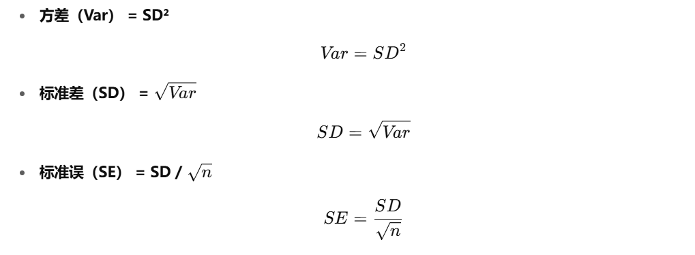
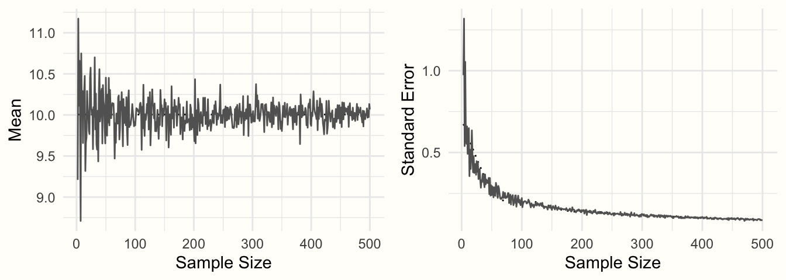
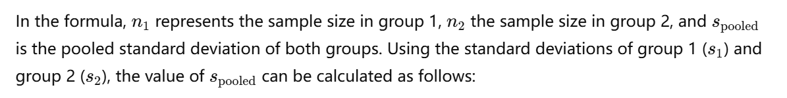
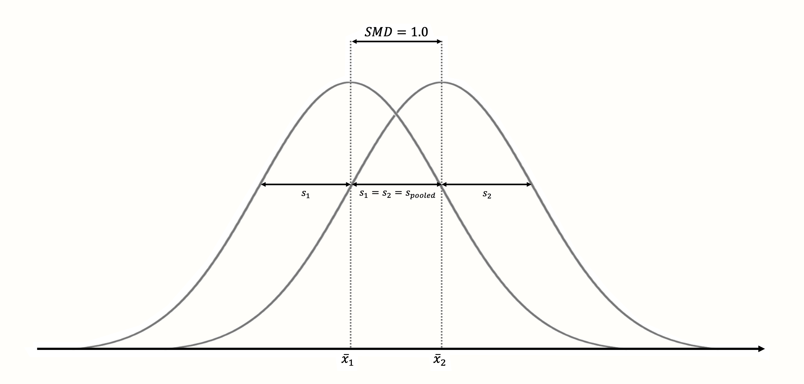

In meta-analyses, studies instead of individuals become the fundamental units of our analysis.独立的原始研究而不是受试者成为分析的基本单位，即合并定量研究的数据。

# 1. Effect size

每项研究会提供一个（多个）效应量，我们的目的是计算每个研究的效应量，并在后续将它们合并，注意，效应量的选择会影响meta分析的结果和可解释性。

- 可比性：当单位不同时，使用SMD进行标准化
- 可计算型：提供n，mean，sd
- 可靠性：同可计算性（计算standard error）
- 可解释性：选择合适的效应量，并解释

**`true effect size`** ：

$$
\theta
$$

更精确地说，$\theta_k$ 代表第 **`k`** 个研究的 **`true effect size`** ：

$$
\theta_k
$$

但是，真实的效应量与我们在发表的研究结果中发现的观察到的效应量并不相同。`观察到的效应量`只是对真实效应量的估计。

通常使用 **`hat(^)`** to clarify that the entity we refer to is only an **`estimate`**. The observed effect size in study k

**our estimate of the true effect size, can therefore be written as：**

$$
\hat{\theta}_k
$$

But why does $\hat{\theta}_k$ differ from $\theta_k$? because of the **`Sampling error`**, which can be symbolized as：

$$
\epsilon_k
$$

Well, Put simply, $\hat{\theta}_k$  is, therefore, the same as：

$$
\hat{\theta}_k = \theta_k + \epsilon_k
$$

- 我们希望 **`observed effect size`** 越接近 **`true effect size`** 越好，而 **`observed effect size`** 就是 $\hat{\theta}_k = \theta_k + \epsilon_k$，所以 $\epsilon_k$ 越小越好。
- 在所有条件相同的情况下，我们可以假设，拥有**较小的抽样误差（$\epsilon_k$）**的研究将提供对真实效应量**更精确的估计**。

所以！权重越大是因为：

1. 抽样误差（标准误）越小
2. 样本量越大（误差越小）

想想抽样误差用什么：sd，se和方差



<aside>

Meta-analysis 考虑了对 $\theta_k$ 估计的精确度，所以我们给**拥有更高精确度**（更小 $\epsilon_k$）的效应量的研究**更大的权重**，因为这些研究提供了对 $\theta_k$ 更精确的估计 ([L. Hedges and Olkin 2014](https://bookdown.org/MathiasHarrer/Doing_Meta_Analysis_in_R/references.html#ref-hedges2014statistical)) 

</aside>

- 因为我们不可能知道整个群体的 **`True effect size`**（总会有测量误差的存在，导致我们的观测效应量只能是一个分布，**`SE`** 越小的研究说明其对于真实值的估计越精确），所以 SE 也不知道，然而，我们可以用统计理论来近似抽样误差。使用 **`stantadard error`** ，计算公式如下：
    
$$
SE = \frac{SD}{\sqrt{n}}
$$
    
- **标准误**定义为**抽样分布的标准差**。**所以标准误的平方就抽样分布的方差**

所以我们提取下述指标即可计算SE：

- **`SD`**
- **`n`**

[SD的计算](https://www.notion.so/SD-1f9980f4c6e3801e88c2c715d72b6ac2?pvs=21)

1. **计算公式：**

$$
SD = \sqrt{\frac{1}{N} \sum_{i=1}^{N} (x_i - \mu)^2}
$$

根据计算公式，先求出未知项 $\mu$，计算公式：

$$
\mu = \frac{1}{N} \sum_{i=1}^{N} x_i
$$

假设我们有这些数据： 2，4，6，8，10

- 加起来： 2+4+6+8+10=30
- 样本量： N = 5
- 平均值（$\mu$）为：
    
  $$
  \mu = \frac{30}{5} = 6
  $$
    

**2. 每个数据点与平均值的差异：$(x_i - \mu)$**

- 接下来，我们需要看每个数据点和平均值之间的差异。对于每个数据点 $x_i$，计算它与平均值的差：
- 例如，对于数据点 2，它和平均值 6 之间的差是：$2 - 6 = -4$
- 对其他数据点也做同样的计算，得到每个数据点和平均值的差异。

**3. 差异的平方 $(x_i - \mu)^2$**

- 将每个差异值平方。这样做是为了避免负值影响结果（因为如果不平方，负差异和正差异会抵消掉），例如：
    - 对于 $2 - 6 = -4$，平方后得到 $(-4)^2 = 16$。
    - 对于 $4 - 6 = -2$，平方后得到 $(-2)^2 = 4$。
    - 对于 $6 - 6 = 0$，平方后得到 $0^2 = 0$。
    - 对于 $8 - 6 = 2$，平方后得到 $2^2 = 4$。
    - 对于 $10 - 6 = 4$，平方后得到 $4^2 = 16$。

### 4. **求平方差异的平均值**

将所有平方差异加起来，然后除以数据的数量 N。这个值叫做方差（Variance）。例如：

- 平方差异：16,4,0,4,16
- 加起来：16+4+0+4+16=40
- 平均方差（方差）就是：8
- $\frac{40}{5} = 8$

### 5. **取平方根**

- 最后一步是取这个方差的平方根，得到标准差：

$$
SD = \sqrt{8} \approx 2.83
$$

### 总结：

标准差的计算过程是：

1. 计算所有数据的平均值（均值）。
2. 计算每个数据点与平均值的差。
3. 将每个差值取平方。
4. 计算所有平方差的平均值（方差）。
5. 取方差的平方根，得到标准差。

可以使用**贝塞尔校正**

[SE的计算](https://www.notion.so/SE-1f8980f4c6e38092a27ad24d5e734dce?pvs=21)

我们之前的样本是：

1. 标准差（s） ≈ 2.83
2. 样本数量（n） 是：n=5
3. 计算标准误（SE）：

$$
SE = \frac{2.83}{\sqrt{5}} = 1.266
$$

现在，我们在R中使用 **`rnorm`** 函数，在一个已知分布的群体中（normality distribution）随机抽取既定均值，标准差和N出来：

1. notable, The `rnorm` function has a random component, so to make results reproducible, we have to set a **seed** first. 

```r
set.seed(123)
sample <- rnorm(n = 50, mean = 10, sd = 2)
mean(sample)
> mean(sample)
[1] 10.06881
```

我们可以看到，非常接近预定的均值（10）了，因为我们使用 `rnorm` 创建了一个 “perfect world”，均值 10、标准差为 2，当我们在 8-12 中抽取 50 个样本时，平均值也已经非常接近真实值了。根据中心极限定理，样本量足够大时，样本一定是呈现正态分布，所以我们把抽样数量增加至 500，会得到更接近 $\mu$ 的 $\bar{x}$。

- In formula, we can see that the standard error of the mean depends on the sample size of a study. When $n$ becomes larger, the standard error becomes smaller, meaning that a study’s estimate of the true population mean becomes more precise.

$$
SE = \frac{s}{\sqrt{n}}
$$

- To exemplify this relationship, we conducted another simulation. Again, we used the `rnorm` function, and assumed a true population mean of $\mu = 10$ and that $\sigma = 2$. But this time, we varied the sample size from $n = 2$ to $n = 500$. For each simulation, we calculated both the mean and the standard error using formula 3.2.



我们可以看到，随着样本量的增加：

- `平均值愈发收敛，接近真实均值10`
- `标准误越来越小`

所以我们给样本量更大的研究更大的权重，因为观测效应量更趋向于真实效应量。

<aside>

- 观察到的效应量和真实的效应量之间的差异是由于抽样误差导致的。
- 加权分析，对于样本量更大和标准误更小的研究赋予更大的权重。
</aside>

# **2. Between-Group Mean Difference**

<aside>

在实验（干预）类研究中，通常设置两组（或以上）进行比较，我们想知道组间的差异量，可以使用**Mean Difference**

</aside>

**The between-group mean difference $MD_{\text{between}}$  is defined as：**

- 两个独立组之间原始的、未标准化的均值差异。当一项研究至少包含两个组时，可以计算组间平均差异，这通常是在对照试验（或其他类型的实验研究）中出现的情况。
- 同一结局指标测量单位时使用 `MD`：In meta-analyses, mean differences can only be used when **all** the studies measured the outcome of interest on **exactly** the same scale. Weight, for example, is nearly always measured in kilograms in scientific research; and in diabetology, the HbA1c value is commonly used to measure the blood sugar.

**均值差定义为第1组的均值减去第2组的均值：**

$$
MD_{\text{between}} = \bar{x}_1 - \bar{x}_2
$$

The standard error $SE_{MD_{\text{between}}}$ 可以通过以下公式求得：

$$
SE_{MD_{\text{between}}} = s_{\text{pooled}} \sqrt{ \frac{1}{n_1} + \frac{1}{n_2} }
$$



$$
s_{\text{pooled}} = \sqrt{ \frac{(n_1 - 1)s_1^2 + (n_2 - 1)s_2^2}{(n_1 - 1) + (n_2 - 1)} }
$$

- 但一般来说，为消除基线的差异带来的结果不可比性，取前后测的差值进行组间比较：

前后测差值的计算方法：

$$
\bar{D} = \bar{X}_{\text{post}} - \bar{X}_{\text{pre}}
$$

这很简单对吗，然后是差值的SD：

差值标准差不能简单地用两个 SD 相减，需要考虑它们之间的**相关性（correlation）**，计算公式为：

$$
SD_{\bar{D}} = \sqrt{SD_{\text{pre}}^2 + SD_{\text{post}}^2 - 2 \times r \times SD_{\text{pre}} \times SD_{\text{post}}}

$$

- 默认 r=0.5
- 或使用多个 rrr（如 0.3, 0.5, 0.7）做稳健性分析
- 找到同时汇报前后测和差值的sd的原始研究计算r

**现在我们用R计算一下：**

1. 先模拟数据

```r
# Generate two random variables with different population means
set.seed(123)
x1 <- rnorm(n = 20, mean = 10, sd = 3)
x2 <- rnorm(n = 20, mean = 15, sd = 3)

# Calculate values we need for the formulas
s1 <- sd(x1)
s2 <- sd(x2)
n1 <- 20
n2 <- 20
```

1. With this data at hand, we can proceed to the core part, in which we calculate the mean difference and its standard error using the formulae we showed before:

```r
# Calculate the mean difference
MD <- mean(x1) - mean(x2)
MD
> MD
[1] -4.421357
```

```r
# Calculate s_pooled
s_pooled <- sqrt(
  (((n1-1)*s1^2) + ((n2-1)*s2^2))/
    ((n1-1)+(n2-1))
)

# Calculate the standard error
se <- s_pooled*sqrt((1/n1)+(1/n2))
se
> se
[1] 0.8577262
```

看起来很复杂对吗？但不需要过度担心，你只需要在数据中准备好下面几列：

- **`n.e`**. The number of observations in the intervention/experimental group.
- **`mean.e`**. The mean of the intervention/experimental group.
- **`sd.e`**. The standard deviation in the intervention/experimental group.
- **`n.c`**. The number of observations in the control group.
- **`mean.c`**. The mean of the control group.
- **`sd.c`**. The standard deviation in the control group.

# **3. Between-Group Standardized Mean Difference**

1. 计算cohend’s d
2. 校正为hedges’s g
3. 可以轻松的在meta和metafor内完成

**`SMD`** 也称为 **`Cohen’s d`**（即没有被校正的 **`g`**）, 通过两组之间的差值dividing合并后的标准差即

$S_{\text{pooled}}$ 获得：

$$
SMD_{\text{between}} = \frac{\bar{x}_1 - \bar{x}_2}{S_{\text{pooled}}}
$$

**`SMD`**：This is a standard way to represent effect sizes in meta-analyses, making results more interpretable and comparable across studies. 即使研究间使用不同的结局指标单位，SMD也可以将研究的效应量标准化，使得研究间可比和结果可解释。

- **计算SMCID很重要：**
    
    for depression treatment, even effects as small as $SMD_{\text{between}} = 0.24$ can have a clinically important impact on the lives of patients ([Pim Cuijpers et al. 2014](https://bookdown.org/MathiasHarrer/Doing_Meta_Analysis_in_R/references.html#ref-cuijpers2014threshold)).
    

$SMD_{\text{between}} = 1$ 表示两组均值相差一个样本标准差：



标准化使评估平均差的大小变得容易得多。标准化平均差异通常使用Cohen（1988）的惯例来解释：

| **`SMD ≈ 0.20:`** | 🟢 **效应小** |
| --- | --- |
| **`SMD ≈ 0.50:`** | 🟡 **效应中等** |
| **`SMD ≈ 0.80:`** | 🔴 **效应大** |

The **`SE`** of $SMD_{\text{between}}$ can be calculated using this formula ([Borenstein et al. 2011](https://bookdown.org/MathiasHarrer/Doing_Meta_Analysis_in_R/references.html#ref-borenstein2011introduction))：

$$
SE_{SMD_{\text{between}}} = \sqrt{ \frac{n_1 + n_2}{n_1 n_2} + \frac{SMD_{\text{between}}^2}{2(n_1 + n_2)} }
$$

所以到这里我们已经知道如何计算 $SMD_{\text{between}}$ 和 $SE_{SMD_{\text{between}}}$，这样每个研究的标准化均值差和相应的标准误已知，当每个研究都计算出相应的 $yi$ 和 $vi$ 后，就可以进行效应量合并了。

是时候在`R`中试一试：

```r
# Load esc package
library(esc)

# Define the data we need to calculate SMD/d
# This is just some example data that we made up
grp1m <- 50   # mean of group 1
grp2m <- 60   # mean of group 2
grp1sd <- 10  # sd of group 1
grp2sd <- 10  # sd of group 2
grp1n <- 100  # n of group1
grp2n <- 100  # n of group2

# Calculate effect size
esc_mean_sd(grp1m = grp1m, grp2m = grp2m, 
            grp1sd = grp1sd, grp2sd = grp2sd, 
            grp1n = grp1n, grp2n = grp2n)

       
Effect Size Calculation for Meta Analysis
## 
##      Conversion: mean and sd to effect size d
##     Effect Size:  -1.0000
##  Standard Error:   0.1500
##            [...]
```

**让我理清楚计算的过程：**

1. **我提供了原始数据：（在真实世界中可能需要先计算单个组的前后测组间均值差，以及前测后测的均值差的相应标准差）**

| 组别 | 样本量 n | 平均值 m | 标准差 sd |
| --- | --- | --- | --- |
| 组1 | 100 | 50 | 10 |
| 组2 | 100 | 60 | 10 |
1. 效应量的计算公式是：

$$
SMD_{\text{between}} = \frac{\bar{x}_1 - \bar{x}_2}{SD_{\text{pooled}}}
$$

由于$S_{\text{pooled}}$是未知的，所以先计算，$S_{\text{pooled}}$ 的计算公式：

$$
s_{\text{pooled}} = \sqrt{ \frac{(n_1 - 1)s_1^2 + (n_2 - 1)s_2^2}{(n_1 - 1) + (n_2 - 1)} }
$$

带入真实数据：

$$
s_{\text{pooled}} = \sqrt{ \frac{(100 - 1)10^2 + (100 - 1)10^2}{(100 - 1) + (100 - 1)} }
$$

$$
s_{\text{pooled}} = \sqrt{ \frac{(100 - 1) \cdot 10^2 + (100 - 1) \cdot 10^2}{99 + 99} }
= \sqrt{ \frac{99 \cdot 100 + 99 \cdot 100}{198} }
= \sqrt{ \frac{19800}{198} }
= \sqrt{100} = 10
$$

已知$S_{\text{pooled}}$ 后，计算$SMD_{\text{between}}$ ：

$$
SMD_{\text{between}} = \frac{\bar{x}_1 - \bar{x}_2}{s_{\text{pooled}}} = \frac{50 - 60}{10} = -1.0

$$

计算 **`SE`** :

$$
SE_{SMD_{\text{between}}} = \sqrt{ \frac{n_1 + n_2}{n_1 n_2} + \frac{SMD_{\text{between}}^2}{2(n_1 + n_2)} }
$$

$$
SE_{SMD_{\text{between}}} = \sqrt{ \frac{200}{100 \cdot 100} + \frac{1^2}{2 \cdot 200} }
= \sqrt{ \frac{200}{10000} + \frac{1}{400} }
= \sqrt{0.02 + 0.0025}
= \sqrt{0.0225} = 0.15
$$

构建 **`95%CI`**：

$$
\begin{aligned}
\text{95\% CI} &= \hat{\theta} \pm 1.96 \cdot SE_{\text{SMD}_{\text{between}}} \\
              &= -1.0 \pm 1.96 \cdot 0.15 \\
              &= (-1.294,\ -0.706)
\end{aligned}
$$

所以我们得到了：

| 合并标准差 $S_{\text{pooled}}$ | 10 |
| --- | --- |
| Cohen's d | -1.00 |
| 标准误（SE） | 0.15 |
| 95% CI | (-1.29, -0.71) |

手算结果和R的输出结果保持一致。

```r
Effect Size Calculation for Meta Analysis
##     Conversion: mean and sd to effect size d
##     Effect Size:  -1.0000
##     Standard Error:   0.1500
##     Lower CI:  -1.2940
##     Upper CI:  -0.7060
##     [...]
```

<aside>

**如何解释结果？**

注意所选的效应量是Lower is better 还是Higher is better，如果不统一会导致严重的错误出现。

</aside>

计算 $SMD_{\text{between}}$ 和 $SE_{SMD_{\text{between}}}$ 所需的数据准备和上述的 $MD_{\text{between}}$ 和 $SE_{MD_{\text{between}}}$ 一致：

- **`n.e`**. The number of observations in the intervention/experimental group.
- **`mean.e`**. The mean of the intervention/experimental group.
- **`sd.e`**. The standard deviation in the intervention/experimental group.
- **`n.c`**. The number of observations in the control group.
- **`mean.c`**. The mean of the control group.
- **`sd.c`**. The standard deviation in the control group.

# **Effect Size Correction**

$$
\hat{\theta}_k = \theta_k + \epsilon_k

$$

前面我们提到了：估计效应量和真实效应量的差异仅来源于**`sampling error`**，根据公式可得抽样误差越小，观测效应量越收敛于真实效应量。

- **In this chapter, we will cover :**
    1. **three commonly used effect size correction procedures**, 
    2. and **how we can implement them in *R***.

**3.4.1 Small Sample Bias**
观测到小样本更可能观测到大效应量（特别是 $n \le 20$），这种小样本偏差意味着当研究的总样本量很小时，SMD 系统地高估了真实效应量的大小。所以需要对小样本偏倚进行校正，也就是将 **`SMD/Cohen’s d`** 校正为 **`Hedge's g`**，校正计算公式如下：

$$
g = \text{SMD} \times \left( 1 - \frac{3}{4N - 9} \right)
$$

注意这里的$n$是total sample size

```r
SMD * (1 - 3 / (4 * n - 9) )
```

```r
# Load esc package
library(esc)

# Define uncorrected SMD and sample size n
SMD <- 0.5
n <- 30

# Convert to Hedges g
g <- hedges_g(SMD, n)
g

## [1] 0.4864865
```

# **The Unit-of-Analysis Problem**

- It is not uncommon that a study contributes **more than one effect size** to our meta-analysis.
    1. a study included more than two groups, or that 
    2. a study measured an outcome using two or more instruments. 
    3. 多个时间点的重复测量
- if 多个处理共用一个对照：
    
    （1）方差-协方差矩阵的构建 VCV）
    
    （2）使用稳健方差估计（RVE）模型也可以处理
    
- The best approach is to include data from all available instruments, and use meta-analytic models which can account for the fact that studies in our meta-analysis contribute more than one effect size. This can be achieved by **“three-level” meta-analysis** models, which we will examine in Chapter [10](https://bookdown.org/MathiasHarrer/Doing_Meta_Analysis_in_R/multilevel-ma.html#multilevel-ma).
- **What criteria does an effect size metric have to fulfill to be usable for meta-analyses?**
    
    It needs to be comparable, computable, reliable and interpretable.
    

# **Summary**

1. 权重的确定：给予样本量大和SE小的研究大权重。
2. 效应量的计算：

[多个处理共用一个对照（方差-协方差矩阵的构建 VCV）](https://www.notion.so/VCV-201980f4c6e38031afd5ed434265658f?pvs=21)
